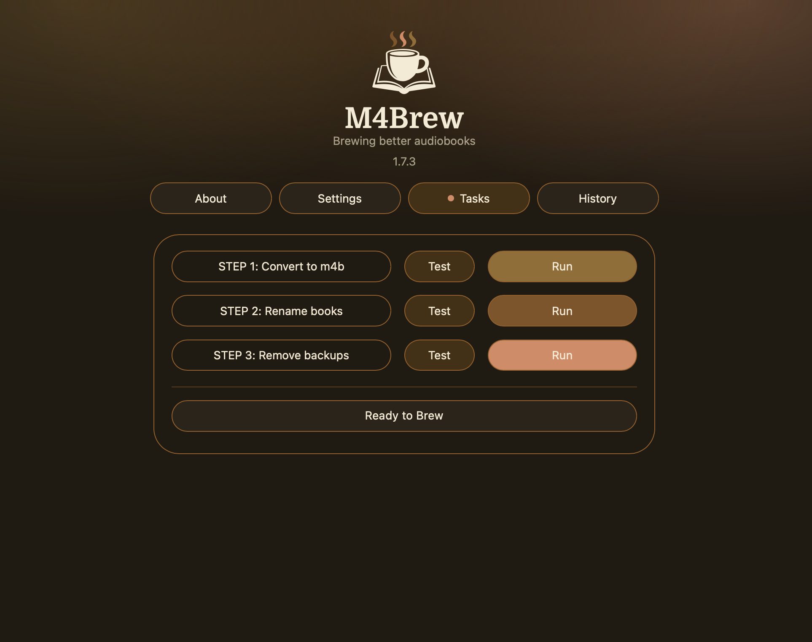
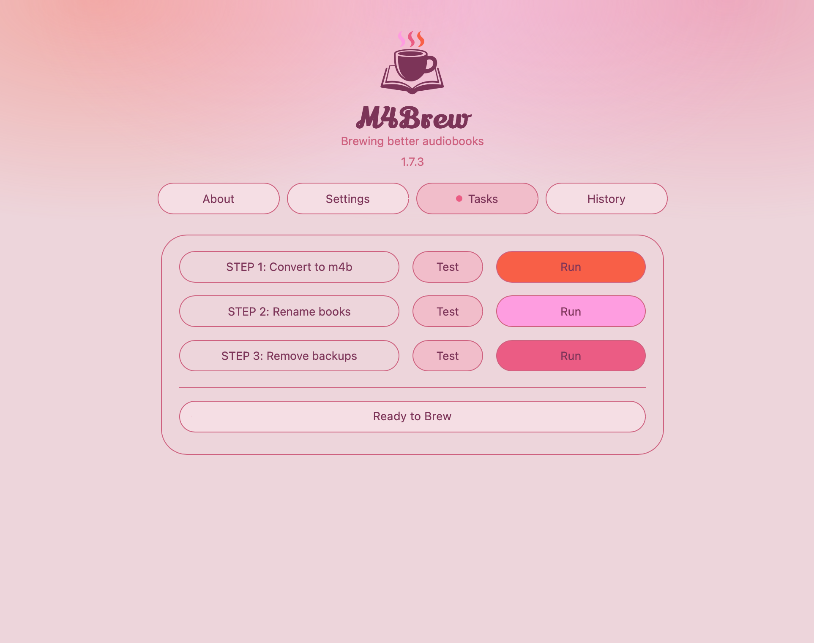

# M4Brew

**Brew better audiobooks.**

M4Brew converts messy audiobook folders into clean, reliable, chapterised M4B (AAC) files — safely, predictably, and without manual FFmpeg work.

Designed for users of:
	•	Plex
	•	Jellyfin
	•	Audiobookshelf
	•	Any M4B-friendly player

---

## 📸 Screenshots

| Home 1 | Home 2 |
|--------|--------|
|  |  |

| Converting | History |
|------------|----------|
|  | 

---

### Who it’s for

M4Brew is for anyone with audiobook folders full of:
	•	MP3 parts
	•	M4A files
	•	Split M4B files

…who wants clean, properly structured single-file .m4b outputs **without scripting or command line work.**

⸻

### What M4Brew Does

M4Brew batch converts audiobooks into **single, chapterised .m4b files** using FFmpeg under the hood.
Each source file becomes a chapter in the final book.
Output files are:
	•	Easier for media managers to recognise
	•	Cleaner to tag and match with metadata
	•	More reliable across players
	•	Safer to back up

⸻

### Supported Input Formats
	•	MP3 (single or multi-file)
	•	M4A (single or multi-file)
	•	M4B (multi-file merge)
Output is always:
A single chapterised .m4b file (AAC audio)

⸻

### Smart Merging

M4Brew includes intelligent safety checks:
	•	Multi-file books are merged in correct numeric order
	•	If part order is unclear, the book is skipped safely
	•	No partial or incorrectly ordered merges
	•	Clear warnings are shown in the UI and history
Safety is always prioritised over guessing.

⸻

### Test vs Run

Every task supports two modes:
**Test**
	•	Simulates the operation
	•	Shows exactly what would happen
	•	Makes no changes
**Run**
	•	Performs the actual conversion / rename / cleanup
	•	Safe cancel support
	•	No half-written files
***Nothing destructive happens unless you explicitly run it.***

⸻

### Folder Structure (Required)

***M4Brew expects your audiobooks to be organised like this:***

```text
Audiobooks/
└── Author Name/
    └── Book Title/
        └── audio files
```

This structure ensures:
	•	**Correct output naming**
	•	**Reliable metadata matching**
	•	**Consistent chapter generation**

⸻

## Mapped Folders (Unraid Setup)

When installing via Community Applications, you’ll see:
	•	Audiobooks 1
	•	Audiobooks 2
	•	Audiobooks 3

Set these to your audiobook paths.
They will then appear in the Mapped folder dropdown inside M4Brew.
Only one is required — others are optional.

⸻

## Audio Settings

You can choose:
	•	Custom output
	•	Custom bitrate
	•	Or **Match both**

⸻

## Safety Design

M4Brew is intentionally cautious:
	•	***Originals are never automatically deleted***
	•	Converted files are created alongside your structure
	•	Cleanup is a separate, explicit step
	•	Order issues do not stop the whole batch
	•	Warnings are logged clearly in History

***No surprises.***

⸻

## Under the Hood

M4Brew uses:
	•	**FFmpeg** for audio processing
	•	Clean, minimal Flask UI
	•	Docker container deployment
It wraps professional media tooling in a focused interface built specifically for audiobook workflows.

⸻

## Themes

M4Brew now includes **multiple visual themes.**
Because if you’re going to brew audiobooks…
it might as well look good while doing it.

⸻

Project Status - v1.7.3 — Stable
	•	Core conversion workflow complete
	•	Safety logic hardened
	•	Batch behaviour reliable
	•	History logging polished
	•	Known issues addressed
Fingers crossed — all major bugs squashed.

Future updates may include:
	•	Additional input formats
	•	Minor UX refinements

Enjoy.

☕
